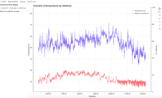
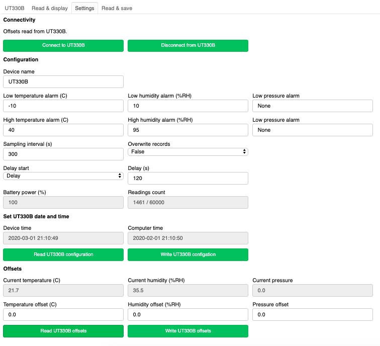

=============================
How to use the UT330 software
=============================

Introduction
============

I work in an office and I thought the temperature was changing more than was comfortable through the day. Sometimes, I would be cold and sometimes hot. I wanted a cheap temperature logger to monitor the temperature so I could display the temperature history as a chart. 

I looked online on `AliExpress <http://www.aliexpress.com/>`_ and found the UT330B, a USB battery powered temperature and humidity logger. It was cheap ($35) and did what I wanted. The only problem was, it only had Windows software to control it and I use a Mac. The UT330B worked via a USB port, so I thought I could figure out the commands sent over the USB port and build something myself. With great help from `Philip Gladstone <https://github.com/pjsg>`_, I did it. This project is a result of that effort.

.. image:: UT330B.png

With this software, you can control the UT330B, or other UT330 devices, from any platform that runs Python and has a USB port. In the appendices, I list some of the UT330 devices and tell you where you can buy them.

What’s in the software package?
===============================

All of the software was built on Python 3.7 using the Anaconda distribution. Here's what the software is.

UT330
-----

This is the code that provides an interface to the UT330B. It’s fully commented and PEP8 compliant. You can find it in the model subfolder of the UT3330BUI folder.

Test
----

This is a simple script that demonstrates all of the UT330 methods. It’s fully commented and PEP8 compliant. You can find it in the model subfolder of the UT3330BUI folder.

Note that the script might delete all data on the device and do a factory reset - check what's commented out before you use it. Please be careful using it!

UT330BUI
--------

This is a complete app to control the UT330B devices using the UT330 class. It's written using Bokeh 3.0.3. To run the software, go to the folder above the UT330BUI folder and type in: ::

    bokeh serve UT330BUI --show

The code is structured as a model-view-controller architecture.

controller
    controller.py - this controls the software.
model
    UT330.py - explained above.
    
    Test.py - explained above.
view
    intro.py - introduces the software
    
    readdisplay.py - reads in temperature and humidity data from disk and displays it on a chart
    
    readsave.py - reads in temperature and humidity data from the device and saves it to disk
    
    settings.py - controls the UT330B settings
    
Here's a view of the temperature and humidity data.



Here's a view of the UI.



Documentation
-------------

This text.

License
-------

I’m using the MIT License.

Using the UT330 object – a short tutorial
=========================================

Dependencies
------------

The UT330 object depends on the following libraries:

* datetime
* pyserial (version 3.01 or later)
* time

If you don’t already have them, you can install them with the pip install command.

You will need to install the SiLab driver for your OS. It's the USB to UART driver. You can download the driver from here: https://www.silabs.com/products/development-tools/software/usb-to-uart-bridge-vcp-drivers

Connect and read the device name
--------------------------------

For any of this to work, you must connect the UT330 to a USB port on your system.

The software has been designed to work with the Python with command, just like a file object. Here’s how. ::

    from ut330 import UT330

    with UT330() as ut330:                
        print "▉▉▉▉▉▉▉▉▉▉▉▉▉▉▉▉▉▉▉▉▉▉▉▉▉▉▉▉▉▉▉▉▉▉▉▉▉▉▉▉▉▉▉▉▉▉▉▉▉▉"                 
        print "▉▉▉▉▉▉▉▉▉▉▉▉▉▉▉▉▉▉ Reading device name ▉▉▉▉▉▉▉▉▉▉▉▉▉▉▉▉▉▉▉"        
        print "▉▉▉▉▉▉▉▉▉▉▉▉▉▉▉▉▉▉▉▉▉▉▉▉▉▉▉▉▉▉▉▉▉▉▉▉▉▉▉▉▉▉▉▉▉▉▉▉▉▉"              
        print "Device name = {0}".format(ut330.read_device_name())

Here, the UT330 is opened and a variable (ut330) initialized. The function read_device_name is called on the ut330 object and the name is printed. You should see an output something like this: ::

    ut330b

Read the offsets
----------------

The UT330B allows you to set temperature and humidity offsets, allowing you to calibrate it. Here’s how you can read the offsets. ::

    from ut330 import UT330

    with UT330() as ut330:      
        print "▉▉▉▉▉▉▉▉▉▉▉▉▉▉▉▉▉▉▉▉▉▉▉▉▉▉▉▉▉▉▉▉▉▉▉▉▉▉▉▉▉▉▉▉▉▉▉▉▉▉▉"    
        print "▉▉▉▉▉▉▉▉▉▉▉▉▉▉▉▉▉▉ Reading offsets ▉▉▉▉▉▉▉▉▉▉▉▉▉▉▉▉▉"     
        print "▉▉▉▉▉▉▉▉▉▉▉▉▉▉▉▉▉▉▉▉▉▉▉▉▉▉▉▉▉▉▉▉▉▉▉▉▉▉▉▉▉▉▉▉▉▉▉▉▉▉▉"     
    
        offsets = ut330.read_offsets()
        print offsets

The offsets variable is a very simple Python dict: ::

    offsets= {	'temperature offset': 0,                        
                'humidity offset': 0,                        
                'pressure offset': 0}

The UT330B does not have a pressure sensor, so the pressure offset is irrelevant.

Reading the data
----------------

The temperature, humidity, and pressure data can be read from the device using the read_data() method. Here’s an example that shows reading the data and printing the result. ::
    
    # Read data   
    with UT330() as ut330:           
        print "▉▉▉▉▉▉▉▉▉▉▉▉▉▉▉▉▉▉▉▉▉▉▉▉▉▉▉▉▉▉▉▉▉▉▉▉▉▉▉▉▉▉▉▉▉▉▉▉▉▉▉"     
        print "▉▉▉▉▉▉▉▉▉▉▉▉▉▉▉▉▉▉▉ Reading data ▉▉▉▉▉▉▉▉▉▉▉▉▉▉▉▉▉▉▉"   
        print "▉▉▉▉▉▉▉▉▉▉▉▉▉▉▉▉▉▉▉▉▉▉▉▉▉▉▉▉▉▉▉▉▉▉▉▉▉▉▉▉▉▉▉▉▉▉▉▉▉▉▉"     
        DATA = ut330.read_data()              

        if DATA != []:                  

            print  'Timestamp, Temperature (C), Relative humidity (%), Pressure (Pa)\n'   
    
            for data_line in DATA:                          
                line = "{0}, {1}, {2}, {3}\n". format(data_line['Timestamp'],
                                                      data_line['Temperature (C)'],
                                                      data_line['Relative humidity (%)'],
                                                      data_line['Pressure (Pa)'])                                                   
                print line[:-1]

Change the configuration
------------------------

As well as read data from the UT330B, you can also change its settings. Here, I’ll just show one example, changing the configuration information. To do this, we have to create a dict which must be defined like this: ::

    CONFIG = {'device name': 'UT330B',                       
              'sampling interval': 300,                       
              'overwrite records': False,                      
              'delay timing': 120,                       
              'delay start': True,                       
              'high temperature alarm': 40,                       
              'low temperature alarm': -10,                       
              'high humidity alarm': 95,                       
              'low humidity alarm': 10}

The UT330 code shows the valid ranges for these variables, for example, you can have at most ten characters as the device name.

Here’s how you change the configuration and check its changed using the write_config() and read_config() methods. ::

    with UT330() as ut330:           

        # Write config             
        print "▉▉▉▉▉▉▉▉▉▉▉▉▉▉▉▉▉▉▉▉▉▉▉▉▉▉▉▉▉▉▉▉▉▉▉▉▉▉▉▉▉▉▉▉▉▉▉▉▉▉"    
        print "▉▉▉▉▉▉▉▉▉▉▉▉▉▉▉▉▉▉ Write config ▉▉▉▉▉▉▉▉▉▉▉▉▉▉▉▉▉▉▉"    
        print "▉▉▉▉▉▉▉▉▉▉▉▉▉▉▉▉▉▉▉▉▉▉▉▉▉▉▉▉▉▉▉▉▉▉▉▉▉▉▉▉▉▉▉▉▉▉▉▉▉▉"     
        CONFIG = {'device name': 'UT330B',                       
                  'sampling interval': 300,                       
                  'overwrite records': False,                       
                  'delay timing': 120,                       
                  'delay start': True,                       
                  'high temperature alarm': 40,                      
                  'low temperature alarm': -10,                       
                  'high humidity alarm': 95,                       
                  'low humidity alarm': 10}  
            
        ut330.write_config(CONFIG)              

        CONFIG_NEW = ut330.read_config()              

        for k, v in CONFIG.iteritems():                 
            print "{0} Old = {1} New = {2}".format(k, CONFIG[k], CONFIG_NEW[k])

What else can you do?
---------------------

The documentation for the UT330 object describes in more detail what’s available, but here’s a quick summary:

* Write the date and time
* Read and write the offsets
* Read and write the configuration
* Delete the data
* Do a factory reset on the device

UT330BUI
========

Background
----------

I wanted some way of displaying a chart and updating configuration settings using a UI. I could have done this with JavaScript and linked to Python, but I wanted to try out the Bokeh visualization package. 

To try this code, you’ll need to install the Bokeh project. To do this, type: ::

    pip install bokeh

Starting the software
---------------------

The Bokeh application here uses the Bokeh server to provide a web interface. To run the application ::

    bokeh serve UT330BUI --show


The UT330 object's interface
============================

Methods
-------

Disconnect
`````````

**Description**: Disconnects the UT330 device.

**Return value**: No return value.

read_data
`````````

**Description**: Reads the temperature, humidity, and pressure data from the UT330B.

**Return value**: Returns a data dict containing the timestamped temperature, humidity, and pressure data. Here's an example of the data returned: ::

    [{'timestamp': datetime.datetime(2016, 4, 7, 18, 21, 27), 'pressure': 0.0, 'temperature': 25.0, 'humidity': 47.1},
     {'timestamp': datetime.datetime(2016, 4, 7, 18, 26, 27), 'pressure': 0.0, 'temperature': 24.4, 'humidity': 47.6},
     {'timestamp': datetime.datetime(2016, 4, 7, 18, 31, 27), 'pressure': 0.0, 'temperature': 24.2, 'humidity': 48.4},
     {'timestamp': datetime.datetime(2016, 4, 7, 18, 36, 27), 'pressure': 0.0, 'temperature': 24.1, 'humidity': 48.6},
     {'timestamp': datetime.datetime(2016, 4, 7, 18, 41, 27), 'pressure': 0.0, 'temperature': 24.0, 'humidity': 48.6}]
     
delete_data
```````````

**Description**: Deletes the temperature, humidity, and pressure data from the UT330. Note after this operation, there will be no temperature, humidity, or pressure data on the device.

Return value: No return value.

read_config
```````````

**Description**: Reads in the current configuration data from the device.

**Return value**: Returns a configuration dict. Here's an example of the data returned: ::

     {'readings limit': 60000,
      'low humidity alarm': 10,
      'high humidity alarm': 95,
      'overwrite records': False,
      'battery power': 100,
      'low temperature alarm': -10,
      'timestamp': datetime.datetime(2016, 4, 11, 20, 25, 3),
      'sampling interval': 300,
      'delay start': True,
      'delay timing': 120,
      'device name': 'UT330B',
      'high temperature alarm': 40,
      'readings count': 1173}

write_config
````````````

**Description**: Writes configuration data to the device. To check that the configuration has been accepted, I suggest you read the configuration using the read_config method. The configuration data is written using a configuration dict. Here's an example: ::

    CONFIG = {'device name': 'UT330B',
              'sampling interval': 300,
              'overwrite records': False,
              'delay timing': 120,
              'delay start': True,
              'high temperature alarm': 40,
              'low temperature alarm': -10,
              'high humidity alarm': 95,
              'low humidity alarm': 10}

    with UT330() as ut330:
        ut330.write_config(CONFIG)

**Return value**: None.

write_datetime
``````````````

**Description**: Writes the data and time to the device. The date and time is passed in as a Python datetime object as shown in this example: ::

    with UT330() as ut330:
        NOW = datetime.datetime.now()
        ut330.write_date_time(NOW)
        
**Return value**: None.

read_offsets
````````````

**Description**: Reads in the temperature, humidity, and pressure offsets for the device. Here's an example of the data returned. ::

    {'temperature offset': 0.0,
     'temperature': 21.8,
     'humidity': 39.9,
     'pressure': 0.0,
     'humidity offset': 0.0,
     'pressure offset': 0.0}
     
**Return value**: None.

write_offsets
`````````````

**Description**: Writes the temperature, humidity, and pressure offset data to the device. The offsets are passed in as a dict as shown here. ::

    with UT330() as ut330:

        OFFSETS = {'temperature offset': 0,
                   'humidity offset': 0,
                   'pressure offset': 0}

        ut330.write_offsets(OFFSETS)
    
**Return value**: None.

restore_factory
```````````````

**Description**: Restores the factory settings. Note this will overwrite many (if not all) settings.

**Return value**: No return value

read_device_name
````````````````

**Description**: This returns the device name stripped of all leading and trailing blanks. The maximum device name length is 10 characters.

**Return value**: Returns the device name. For example: ::

    ut330b

Attributes
----------

None of the attributes are designed for use outside of the UT330 object. Use them at your own risk.

Functions
---------

Modbus
``````

This calculates a two byte Modbus CRC value. Be careful of the byte ordering when using the values. The UT330 puts the least significant byte first.

Avoiding timing issues – decorators
-----------------------------------

By experiment, I found issues with sending commands and reading the responses very quickly. For example, I found that executing two consecutive read_offsets gave a zero buffer for the second read_offsets. Again by experimentation, I found a delay of 0.01s (10ms) between device commands removed the problem. 

However, we don’t need the delay all of the time. If it’s been more than 10ms since the last command, there’s no point adding a delay. That's why I added the attribute _last_op_time to the UT330 object to check the when the last command was issued. If it was over 10ms, there's no delay.

I implemented this conditional delay using Python’s method decorators. This is the function buffer_safety that appears as the method decorator @buffer_safety.


Appendix
========

Limitations
-----------

I couldn’t find a reliable way to uniquely identify the UT330 device, so I used the pid and vid values returned by serial.tools.list_ports.comports This might not uniquely identify the device because it’s possible that other USB devices report the same values. I’m open to suggestions for uniquely identifying UT330 devices.

I couldn’t identify the use of all bytes in the responses. For example, when reading the configuration, I don’t know what bytes 15-19 are. In all cases where I couldn't identify what bytes are used for, I've put comments in the code. If anyone knows, please let me know.

The UT330B and variants
-----------------------

The UT330B is a battery powered temperature and humidity logger manufactured by Uni-Trend (uni-trend.com), a Chinese company based in Hong Kong. There are several variants of this device on the market:

``*`` UT330 A – temperature only

``*`` UT330 B – temperature and humidity (my device)

``*`` UT330 C – temperature, humidity, and pressure

The device is powered by a ½ AA lithium battery (please note: this is not an AA battery). This is a little hard to find and costs around $10, though you can get cheaper versions online for less. Some of the vendors on AliExpress sell the UT330 including a battery, though they charge a little more.

Because my device (UT330B) has temperature and humidity only, I've not been able to test any pressure functionality. 

Where to buy it
---------------

I’ve seen this device (UT330B) on several websites worldwide. The cheapest place to buy it is from `AliExpress <http://www.aliexpress.com/>`_ where it costs around $35 (including shipping from China), depending on which vendor you buy from. I’ve seen the same device on Amazon in the US for around $70 and I’ve seen it on a specialist electronic supplier’s UK website for £70.

How I found the commands and data
----------------------------------

I did this with a great deal of help from `Philip Gladstone <https://github.com/pjsg/>`_.

We set up a Windows machine and installed the UT330 software. We also installed USB monitoring software. This monitoring software displayed all of the data exchanged on the USB port between the UT330B device and the UT330 software.

We then used the UT330 software to send commands to the UT330 device, for example, clicking on the factory reset button, synching the time etc.

By going through all of the options on the software were able to capture every command and every response as a series of bytes. By changing values, we were able to figure out the format of commands and the responses. For example, we figured out that every command and response started ab cd (in hex) and ended with a two byte CRC. For the offsets, we changed the offset values and examined the bytes on the send command, we then read in the offsets again to see the same values on the receive side. In this way we were able to figure out what each of the commands and responses were.

We were able to find out how multi-byte values and negative values are handled by freezing the UT330 and heating it. It turns out the device uses two’s complement and least significant byte first.

Unfortunately, there were some bytes that I couldn’t figure out a meaning for. I’ve commented these in the code.

By capturing many commands and responses, and by trail and error on the Internet, I found the CRC was a Modbus CRC.
